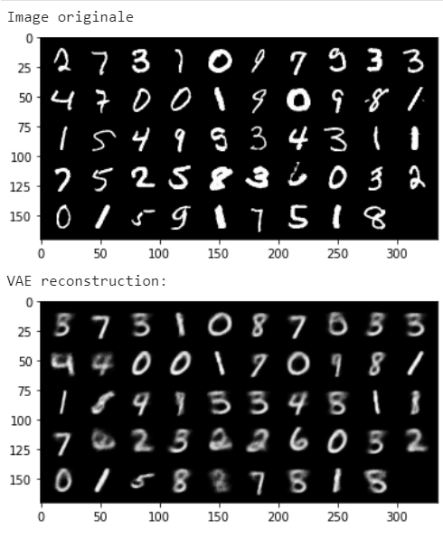
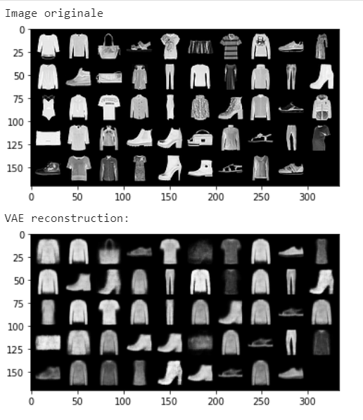
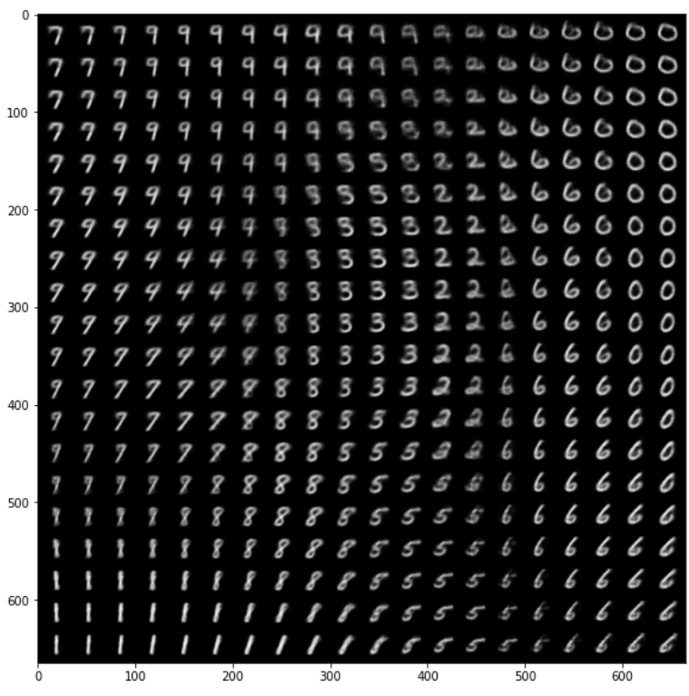
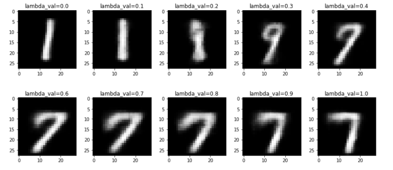
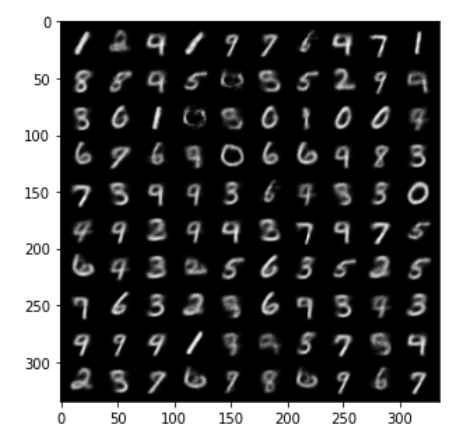
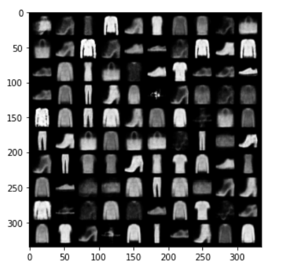

### VAE Reconstruction of MNIST (left) and FashionMNIST Data (right)

## The Latent Space is a space that the VAE has constructed with the trained data, in order to be able to reconstruct them. 
### MNIST Latent Space 

### FashionMNIST Latent Space 

    
### Interpolation in the latent space

### New data generated

